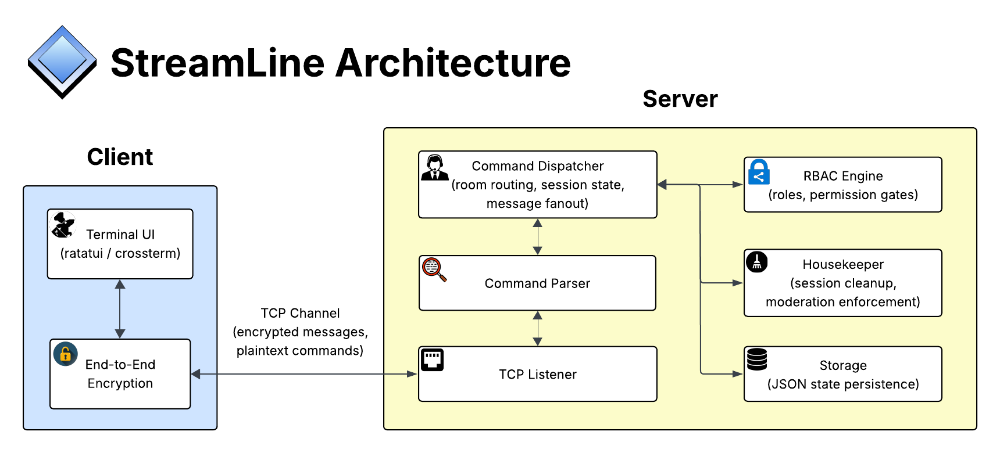

<div align="center">

# StreamLine

_The secure, high-performance, and feature-rich terminal-based LAN chat platform._

[](#)
[](#)
[](#)

</div>

## Overview

Most LAN chat solutions are either trivially simple or rely on bloated infrastructure, but StreamLine is a ground-up, production-quality terminal chat platform engineered entirely in Rust, designed to obtain ultra-low latency in high-concurrency LAN environments. It integrates a custom-built TUI rendering engine, a modular Role-Based Access Control (RBAC) system, and robust client-side End-to-End Encryption (E2EE), all within self-contained binaries with no external service dependencies.

## Key Features

- **Context-Aware TUI Engine:** The frontend utilizes high-performance state-driven terminal rendering, dynamically displaying smart completions, rooms, and room members.
- **RBAC Command Dispatcher:** The server employs a sophisticated Role-Based Access Control (RBAC) system. Over 50 unique commands are supported and dispatched through different modules based on the user's role and room permissions. Account/room management, moderation, user customization, and admin commands all come out of the box.
- **Client-Side E2EE**: Encryption occurs strictly on the client for non-command communications, as the server never possesses the keys required to decrypt those payloads, ensuring true end-to-end privacy for non-command communications.
- **Persistence**: Automated state saving to local JSON storage for seamless use across sessions.

## Example Usage

Launch the server and connect clients across your LAN.

Inside the app:

1. Create an account using `/account register <username> <password> <confirm>`, or sign into an existing one with `/account login <username> <password>`. Tab-complete commands for quick control.
2. Find a room using the side panel and join with `/room join <name>` or create a room with `/room create <name>`. Once in the room, use the side panel to see who's actively online.
3. Start chatting by typing freely, or use `/msg <user> <message>` for direct messages. Use username tab-completions with the @ symbol, and use the arrow keys to navigate your session-persistent input history.
4. Moderate your room with commands like `/mod kick <user> <reason>?`, `/mod mute <user> <duration>? <reason>?`, and `/mod ban <user> <duration> <reason>?`. Commands accessible via your role are visible at a glance via `/help`.
5. Customize access control using `/super` commands. Toggle whitelists, manage role assignments, and fine-tune which commands are available to Moderators and Users on a per-room basis.

## System Architecture

StreamLine employs a client-server architecture with strict separation of concerns across the TUI frontend, TCP transport, server dispatch pipeline, and security subsystems.



1. **Client:** The Terminal UI utilizes `ratatui` and `crossterm`, composing a state-driven multi-panel interface that reacts to client state transitions. All non-command message encryption and decryption occurs strictly here via the end-to-end encryption layer. The client encrypts outgoing payloads with each recipient's RSA public key, then once the recipient receives the message, they decrypt it with their RSA private key. Client keys are persisted only locally.
2. **TCP Channel:** Clients and the server communicate over a TCP connection, carrying 2 distinct payload types: encrypted message ciphertexts and plaintext command strings (parsed and dispatched server-side). This separation is what enables true zero-knowledge message delivery.
3. **Server - Dispatch Pipeline:** Incoming data flows through a `TCP Listener` -> `Command Parser` -> `Command Dispatcher` chain. The dispatcher handles room routing, session state, and message fanout, and consults the `RBAC Engine` on every command invocation to enforce role-based permission gates before any logic executes.
4. **Server - Support Systems:** The `Housekeeper` runs asynchronously alongside the dispatcher, handling session cleanup and timed moderation enforcement (e.g. mute expirations). `Storage` serializes all server state (user data, rooms, roles, bans, whitelists, etc.) to JSON.

## Trade-offs & Design Decisions

- **Rust over Higher-Level Languages:** StreamLine is written entirely in Rust rather than a more accessible language like Go. **Trade-off:** Rust's ownership model has a steeper learning curve and longer initial development time. However, it provides compile-time memory safety guarantees and zero-cost abstractions, eliminating entire classes of bugs and making the high-throughput async architecture significantly more reliable.
- **Client-Side E2EE over Server-Managed Encryption:** Encryption and decryption are performed exclusively on the client. **Trade-off:** This limits the server's ability to perform server-side filtering or content moderation, but provides zero-knowledge message delivery, ensuring that even a compromised server cannot expose non-commands payloads.
- **RBAC at the Dispatcher Level:** Permission checks are evaluated before command logic is invoked, rather than within individual command handlers. **Trade-off:** This adds a layer of indirection to the dispatch pipeline, but ensures authorization is a system-wide invariant rather than a per-command responsibility, making the security model far more maintainable and scalable.
- **Local JSON Persistence over a Database:** Server state is persisted to structured JSON files rather than an embedded or external database. **Trade-off:** JSON is less query-efficient than a relational store, but eliminates external dependencies, minimizing setup overhead.
- **Single-Threaded over Full Parallelism:** The message dispatcher intentionally uses a locked-client, single-threaded model for command processing. **Trade-off:** This caps theoretical maximum throughput, but the single-threaded model also sustains more than sufficient performance for LAN-scale concurrency, as validated by several stress tests.

## Testing & Quality

- **Memory Safety by Design:** Rust's ownership and borrow checker enforce memory safety at compile time, eliminating use-after-free, data races, and null pointer dereferences without garbage collection non-determinism.
- **Error Handling:** Leverages Rust's Result and Option types for exhaustive, compiler-enforced error propagation. No silent failures or unchecked exceptions.
- **Security by Default:** Zero-knowledge server architecture, dispatcher-level RBAC enforcement, and SHA-256 password hashing are baked into the core design.
- **Observability:** Detailed server-side event logging for connection/disconnection lifecycles and security events, providing full auditability of system state.
- **Separation of Concerns:** Encryption, RBAC, dispatch, and rendering logic are cleanly decoupled into distinct modules, enabling isolated reasoning and reducing bug blast radius.

### Performance & Benchmarks

StreamLine is engineered for high-throughput, ultra-low-latency communication. The following metrics represent the software orocessing ceiling measured on a local Linux loopback interface to isolate the application's efficiency from physical network variables:

1. **Massive Concurrency**: System is stable and responsive with over 1,000 simultaneous TCP connections, utilizing only ~25MB of server RAM under peak stress.
2. **Deterministic Processing**: Average round trip time of ~3ms under extreme load (1,000 parallel clients).
3. **High-Throughput Dispatcher**: Capable of sustaining ~3,800 operations per second with a single-threaded message dispatcher.
4. **Resilient Network I/O**: Zero dropped packets or connection failures during burst concurrency tests.

> [!NOTE]
> These benchmarks specifically measure the software's overhead. In a real-world LAN environment (wired or Wi-Fi), physical propagation delay and network hop latency will be additive to these processing times.

## Tech Stack

| Category      | Technologies                    |
| ------------- | ------------------------------- |
| **Frontend**  | Ratatui, Crossterm, Colored     |
| **Backend**   | Rust, Once Cell                 |
| **Security**  | RSA, SHA-2, PKCS#8, Base64, Hex |
| **Data**      | Serde, Serde JSON               |
| **Utilities** | Chrono, Regex, Rand             |

## Images

#### Registering an Account:


#### An Active Chatroom:


#### Moderation & Commands:


#### End-to-End Encryption:


## Role-Command Mapping

For a more detailed look at how the command system works and what each command does, consult [docs/commands.md](/docs/commands.md).

- **Owner**: Access to all commands and full room control, including ownership transfer and room deletion.
- **Admin**: Access to all commands.
- **Moderator/User**: Contextual permissions that can be expanded via `/super roles add` or removed via `/super roles revoke` commands.

### Always-Allowed Commands

| Command                                                                                                                                    | Category  | Description                                          |
| :----------------------------------------------------------------------------------------------------------------------------------------- | :-------- | :--------------------------------------------------- |
| `help`, `clear`, `quit`, `ping`                                                                                                            | Universal | General utility and diagnostics                      |
| **`account`**, `account.register`, `account.login`, `account.logout`, `account.edit`, `account.import`, `account.export`, `account.delete` | Account   | Registration, authentication, and account management |
| **`room`**, `room.list`, `room.join`, `room.create`, `room.import`, `room.delete`                                                          | Room      | Room discovery and management                        |
| **`ignore`**, `ignore.list`, `ignore.add`, `ignore remove`                                                                                 | Ignore    | Block and unblock messages from users                |
| `leave`, `status`                                                                                                                          | In-Room   | Room navigation and session info                     |

### Addable/Revocable Commands

| Command                                                                                                     | Category    | Description                             |
| :---------------------------------------------------------------------------------------------------------- | :---------- | :-------------------------------------- |
| `afk`, `msg`, `me`, `seen`, `announce`                                                                      | Interaction | Core messaging and presence tools       |
| **`user`**, `user.list`, `user.rename`, `user.recolor`, `user.hide`                                         | Identity    | Profile customization and visibility    |
| **`mod`**, `mod.info`, `mod.ban`, `mod.mute`                                                                | Moderation  | Kick, Ban, Mute (with duration support) |
| **`super`**, `super.users`, `super.rename`, `super.export`, `super.whitelist`, `super.limit`, `super.roles` | Room Config | Whitelists, Limits, Role management     |

## Installation & Setup

1. Clone the repository with `git clone https://github.com/BryanWieschenberg/StreamLine.git` and enter the directory with `cd StreamLine`.
2. Install [Rust](https://rustup.rs/#).
3. Run the server:

```bash
# Default port
cargo run --bin server
# OR a custom port
cargo run --bin server <port>
```

4. Run the client:

```bash
# Default port
cargo run --bin client
# OR a custom port
cargo run --bin client -- <port>
# OR a custom IP:port
cargo run --bin client -- <server_ip>:<port>
```
